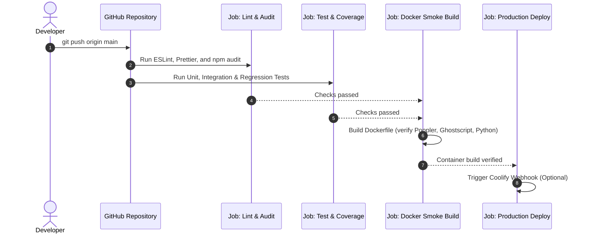

# Testing and Deployment Guide

This guide explains how to run, write, and maintain automated tests for the **Document Pipeline & Smart Cloud Scanner**. It also covers the Continuous Integration and Continuous Deployment (CI/CD) workflow implemented with GitHub Actions.

This documentation follows the [Google Developer Documentation Style Guide](https://developers.google.com/style).

---

## Overview of the Test Architecture

The application uses an automated testing pyramid to ensure safe deployments to production environments (such as Docker or Coolify).

```
                 ┌────────────────────────┐
                 │  Docker Build / Smoke  │  Validates system packages, Python venv,
                 │        (CI Gate)       │  and runtime startup.
                 ├────────────────────────┤
                 │   Integration Tests    │  Tests HTTP endpoints, authentication,
                 │      (Supertest)       │  RBAC, cookies, and rate limiters.
                 ├────────────────────────┤
                 │       Unit Tests       │  Tests business logic, duplicate detection,
                 │  (node:test / assert)  │  path sanitization, and token security.
                 ├────────────────────────┤
                 │    Static Analysis     │  Enforces code quality and checks
                 │   (ESLint, Prettier)   │  dependency vulnerabilities.
                 └────────────────────────┘
```

### Key Components

- **Test Runner:** Native Node.js Test Runner (`node:test`) and assertion library (`node:assert/strict`). Requires no third-party framework overhead, executes natively in Node 20+, and includes native code coverage reporting.
- **HTTP Testing:** [Supertest](https://github.com/ladjs/supertest) for testing Express route handlers and middleware without binding to live network ports.
- **Test Database Isolation:** When `NODE_ENV=test`, the application uses an isolated in-memory SQLite database (`sql.js`). Disk persistence is disabled during tests to prevent locking conflicts or data corruption.
- **Security Regression Suite:** Dedicated tests verify compliance with historical security guidelines documented in [copilot-instructions.md](file:///c:/WSL/adobe_cloud_downloader/.github/copilot-instructions.md) (such as path traversal prevention and command injection safeguards).

---

## Quick Reference: Test Commands

Run the following commands in the root directory of the repository:

| Command | Purpose |
| :--- | :--- |
| `npm test` | Executes all unit, integration, and security regression tests. |
| `npm run test:coverage` | Runs the test suite and outputs a line, branch, and function coverage table. |
| `npm run lint` | Analyzes code quality and syntax issues across `src/` using ESLint. |
| `npm run lint:check` | Verifies that all test files and source files adhere to Prettier formatting. |
| `npm run format` | Automatically formats JavaScript files using Prettier. |

---

## Test Suites

The test files are organized in the `tests/` directory:

```
tests/
├── helpers/
│   └── mockData.js               # Sample jobs, invoices, and token generators
├── integration/
│   ├── authRoutes.test.js        # /api/config, /api/login, /api/admin-login, /api/logout
│   ├── jobRoutes.test.js         # /api/status, /api/jobs/:id/file, access control
│   └── settingsRoutes.test.js    # Admin gating and zero-trust secret protection
├── regression/
│   └── securityRegression.test.js # Verification of historical security fixes
├── unit/
│   ├── auth.test.js              # Token signing, verification, and role evaluation
│   ├── duplicateService.test.js  # String normalization and duplicate scoring
│   └── security.test.js          # Path traversal protection (isSafeSubpath)
└── setup.js                      # Global environment initialization (NODE_ENV=test)
```

### 1. Unit Tests

Unit tests verify individual functions in isolation.

#### Duplicate Detection (`tests/unit/duplicateService.test.js`)
Tests verify that:
- Alphanumeric strings are normalized correctly (for example, `RE-2026/01.A` becomes `re202601a`).
- Duplicate detection matches on identical invoice numbers combined with matching amounts.
- Duplicate detection matches on identical invoice numbers combined with matching dates.
- Duplicate detection flags identical generated file names and original file names.
- Jobs marked with `duplicateDismissed: true` are excluded from comparison.

#### Path Traversal Protection (`tests/unit/security.test.js`)
Tests verify that `isSafeSubpath(baseDir, targetPath)`:
- Allows valid paths inside the target directory.
- Allows files in nested subdirectories.
- Rejects directory traversal payloads (such as `../../etc/passwd` or `..\\..\\Windows\\System32`).
- Rejects absolute paths outside the base directory.
- Safely handles `null`, `undefined`, empty strings, and non-string inputs.

#### Authentication Middleware (`tests/unit/auth.test.js`)
Tests verify that:
- Requests without cookies return `null` and report `isAdmin === false`.
- Invalid or forged JWT tokens signed with incorrect secrets are rejected.
- Valid tokens return decoded user payloads and evaluate roles (`admin` versus `user`) accurately.

---

### 2. Integration Tests

Integration tests verify interactions between the Express application, route handlers, middleware, and database state.

#### Authentication Routes (`tests/integration/authRoutes.test.js`)
- `GET /api/config`: Returns public feature flags without exposing passwords.
- `POST /api/login`: Validates passwords, rejects incorrect credentials with HTTP 401, and issues `auth_token` cookies with `HttpOnly` and `SameSite` flags.
- `POST /api/admin-login`: Restricts access to administrator credentials.
- `POST /api/logout`: Clears the session cookie.

#### Settings and Zero-Trust Secret Protection (`tests/integration/settingsRoutes.test.js`)
- `GET /api/settings`: Rejects unauthenticated requests and standard users with HTTP 403.
- Verifies that sensitive third-party API keys (`LEXOFFICE_KEY_*`, `BUTTLER_KEY_*`, `CLICKUP_*`) are **never** returned in the response payload.

#### Job Routes and File Access (`tests/integration/jobRoutes.test.js`)
- `GET /api/status`: Returns job queue status and respects user versus administrator visibility.
- `GET /api/jobs/:id/file`: Blocks unauthenticated or non-admin access to private documents (`isPrivate: true`) with HTTP 403.
- Blocks attempts to download files outside the designated `downloads/` directory with HTTP 403.

---

### 3. Security Regression Tests

Located in `tests/regression/securityRegression.test.js`, this suite enforces project-wide security standards:

- **Rule A (Path Traversal):** Confirms that file names from external sources are sanitized with `path.basename()` before accessing the file system.
- **Rule B (Command Injection):** Scans all JavaScript files in `src/` to verify that `child_process.exec()` is never used. Child processes must only be invoked using `execFile()` with strict argument arrays.
- **Rule E (AI JSON Fallback):** Validates the structure and type safety of fallback metadata objects when external LLMs or OCR services fail or time out.

---

## Continuous Integration (GitHub Actions)

The repository includes an automated workflow defined in `.github/workflows/ci.yml`.

### Workflow Triggers

The pipeline runs automatically on:
- Every `push` to the `develop` branch.
- Every `pull_request` targeting the `develop` branch.
- Actions on `main` do not trigger this pipeline.

### Pipeline Stages



1. **Lint & Security Audit (`lint-and-audit`):**
   - Installs clean dependencies using `npm ci`.
   - Runs ESLint syntax and code quality checks (`npm run lint`).
   - Checks code formatting against Prettier standards (`npm run lint:check`).
   - Scans dependencies for known security vulnerabilities (`npm audit --audit-level=high`).

2. **Automated Tests (`test`):**
   - Executes the complete test suite with line and branch coverage.
   - Generates code coverage reports directly in the CI job log.

3. **Docker Build Smoke Test (`docker-smoke-build`):**
   - Compiles the application's multi-stage `Dockerfile`.
   - Ensures that native system dependencies (`tesseract-ocr`, `poppler-utils`, `ghostscript`, Python virtual environment) install and build cleanly.
   - Blocks broken container configurations from reaching production.

4. **Production Deployment Gate (`deploy`):**
   - Executes only when all preceding jobs pass on the `main` branch.
   - Triggers the production webhook (such as Coolify) if the `COOLIFY_DEPLOY_WEBHOOK` secret is configured.

---

## Adding New Tests

When creating new features or fixing bugs:

1. **Create a test file:** Place unit tests in `tests/unit/<feature>.test.js` and route tests in `tests/integration/<route>.test.js`.
2. **Use the native test runner:**
   ```javascript
   const test = require("node:test");
   const assert = require("node:assert/strict");

   test("Feature description", async (t) => {
     await t.test("specific scenario description", () => {
       assert.equal(actualValue, expectedValue);
     });
   });
   ```
3. **Format your code:** Run `npm run format` before committing.
4. **Verify locally:** Confirm that `npm test` and `npm run lint` pass without errors.
