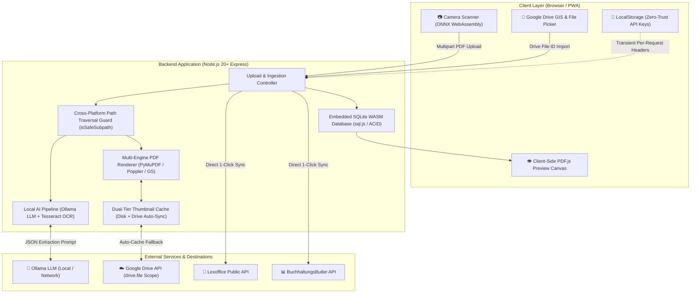

# Document Pipeline & Smart Cloud Scanner

[](https://nodejs.org/)
[-blue.svg)](https://sql.js.org/)
[-success.svg)](docs/testing-guide.md)
[](#zero-trust-privacy-and-security)
[](.github/workflows/ci.yml)
[](https://coolify.io/)

A modern, high-performance document ingestion, AI metadata extraction, and multi-tenant accounting synchronization platform. The system features real-time client-side document edge detection, offline AI metadata extraction through Ollama, dual-tier thumbnail caching, zero-trust third-party secret management, and direct integration with **Lexoffice** and **BuchhaltungsButler**.

---

## Architecture overview

The following diagram illustrates the flow of data through the ingestion, processing, persistence, and external integration layers:



---

## Key features

### 📷 Smart document scanner and edge detection
* **Real-time corner detection:** Identifies document boundaries using client-side WebAssembly computer vision models (`doc_corner_net.onnx`).
* **Perspective correction:** Automatically deskews, crops, and flattens paper receipts and invoices before uploading.
* **Multi-page document capture:** Scans multi-page paper documents directly from mobile devices and merges them into a clean, unified PDF.

### 🖼️ Dual-tier thumbnail and caching engine
* **Sub-millisecond local cache:** Cached thumbnail images (`thumb_<id>.jpg`) resolve directly from disk in under 1 millisecond.
* **Multi-engine fallback renderer:** Generates high-resolution document previews using an automatic engine fallback chain: PyMuPDF (`fitz`) &rarr; Poppler (`pdftoppm`) &rarr; Ghostscript (`gs`) &rarr; GraphicsMagick (`gm`) &rarr; `pdf2pic`.
* **Automatic cloud auto-cache:** If a document only resides in Google Drive, the thumbnail endpoint automatically fetches Google's native high-resolution thumbnail or streams the file, renders it, and saves it to local disk cache for subsequent instant loads.
* **In-flight request deduplication:** Concurrent requests for the same thumbnail are batched into a single promise to prevent redundant rendering or network calls.

### 🤖 Local AI extraction and metadata pipeline
* **Offline Ollama integration:** Automatically parses unstructured invoice documents and extracts company name, category, invoice number, gross amount, and document date without third-party cloud AI vendors.
* **Semantic duplicate detection:** Multi-criteria scoring algorithm (`normalizeAlphaNum`) checks combinations of invoice numbers, document dates, partner names, and gross amounts to flag duplicate submissions before transfer.
* **ExifTool metadata embedding:** Permanently writes extracted AI metadata directly into PDF Exif metadata tags for offline file indexers and desktop search tools.

### 💼 Multi-tenant accounting synchronization
* **Lexoffice integration:** Direct synchronization of parsed vouchers and invoices to Lexoffice vouchers.
* **BuchhaltungsButler integration:** Full support for BuchhaltungsButler receipt searches and uploads with automatic error normalization.
* **Unlimited client profiles:** Maintain multiple client profiles (e.g. separate business entities) with individual API credentials.
* **Live connection testing:** Verify credentials and connectivity in real time directly from the settings interface.

### 🔒 Zero-trust privacy and security
* **Zero-trust credential storage:** Third-party credentials (Lexoffice tokens, BuchhaltungsButler keys, ClickUp tokens) reside strictly in your browser's `localStorage`. The server never persists external API credentials in database tables or configuration files.
* **Cross-platform path traversal protection:** A central `isSafeSubpath` guard strictly enforces boundaries against POSIX and Windows path-traversal payloads (`../../etc/passwd`, Windows drive-letter root attempts).
* **Least-privilege Google Drive permissions:** Uses the restricted `drive.file` scope. The application only receives access to files explicitly opened or created by the user.
* **Rate-limiting and security headers:** Protected by `express-rate-limit` (brute-force lockout after 5 consecutive failures) and `helmet` with a strict Content Security Policy (CSP).

### 💾 High-performance embedded SQLite storage
* **WASM-powered engine:** Uses `sql.js` (WebAssembly-compiled SQLite) for 100% platform independence with zero native C++ compilation (`node-gyp`) requirements.
* **Crash-resilient persistence:** Atomic database write cycles prevent database corruption across unexpected system reboots or container stops.
* **Pre-indexed schema:** Fast lookups by status, upload date, invoice number, and document category.

### 🚀 Automated CI/CD and deployment pipeline
* **GitHub Actions quality gate:** Automated pipeline enforcing ESLint code quality, Prettier style consistency, and high-severity vulnerability audits (`npm audit --audit-level=high`).
* **Zero-dependency test suite:** 58+ unit, integration, and security regression tests executing on native `node:test` and `node:assert/strict` in ~2 seconds.
* **Docker container build validation:** Automated multi-stage Docker build smoke tests verify native system packages (`poppler-utils`, `ghostscript`, Python venv) during CI runs.
* **Automated release Pull Requests:** Successful CI runs on `develop` automatically create or update a Release Candidate Pull Request targeting `main`.

---

## Technology stack

| Component | Technology | Purpose |
| :--- | :--- | :--- |
| **Frontend UI** | HTML5, Vanilla ES Modules, Bootstrap 5, Material Symbols | Clean, lightweight client interface |
| **Client Vision & PDF** | ONNX Runtime Web (WASM), OpenCV.js, PDF.js | Browser-based edge detection and document rendering |
| **Backend Runtime** | Node.js 20+ / 22 (Express 5) | Core application and REST API server |
| **Database Engine** | SQLite via `sql.js` (WebAssembly) | Zero-lock, ACID-compliant local persistence |
| **Document Processing** | Python 3 (PyMuPDF), Poppler (`pdftoppm`), Ghostscript | Multi-engine document rasterization and thumbnail generation |
| **Metadata Tagging** | ExifTool (`exiftool-vendored`) | Embeds structured metadata into PDF binaries |
| **Authentication** | JWT, HTTP-only SameSite Cookies | Secure session management with role-based access |
| **CI / CD** | GitHub Actions, GitHub CLI (`gh`) | Automated testing, linting, audits, and release PR creation |
| **Deployment** | Docker (Debian Bookworm), Coolify | Containerized deployment with persistent volume mounts |

---

## Getting started

### System prerequisites
* **Node.js**: Version 20.0.0 or higher (Node 22 LTS recommended)
* **Python**: Version 3.10 or higher
* **System packages**: `poppler-utils`, `ghostscript`, `graphicsmagick`, `exiftool`
* **Ollama**: An accessible Ollama instance (running locally or across the network)

### Local installation

1. **Clone the repository:**
   ```bash
   git clone https://github.com/smarthomeagentur/adobe_cloud_downloader.git
   cd adobe_cloud_downloader
   ```

2. **Install Node.js dependencies:**
   ```bash
   npm install
   ```

3. **Set up the Python environment:**
   ```bash
   python3 -m venv venv

   # On Linux / macOS / WSL:
   source venv/bin/activate
   pip install opencv-python-headless numpy pytesseract pymupdf

   # On Windows (PowerShell):
   .\venv\Scripts\Activate.ps1
   pip install opencv-python-headless numpy pytesseract pymupdf
   ```

4. **Configure environment variables:**
   Create your local `.env` file from the provided template:
   ```bash
   cp .env.example .env
   ```
   Configure mandatory passwords (`APP_PASSWORD`, `ADMIN_PASSWORD`, and a strong `JWT_SECRET`).

5. **Start the application:**
   ```bash
   npm start
   ```
   Access the web interface at [http://localhost:3000](http://localhost:3000).

---

## Development and testing

The project uses the native Node.js test runner (`node:test`) and assertion library (`node:assert/strict`), avoiding heavy third-party testing framework dependencies.

### Running tests

* **Run all tests (Unit, Integration, Security Regression):**
  ```bash
  npm test
  ```
* **Run tests with coverage analysis:**
  ```bash
  npm run test:coverage
  ```
* **Run code linting:**
  ```bash
  npm run lint
  ```
* **Run linting and Prettier style checks:**
  ```bash
  npm run lint:check
  ```
* **Format codebase:**
  ```bash
  npm run format
  ```

For comprehensive test suite documentation, mock structures, and CI pipeline stages, consult the [Testing guide](docs/testing-guide.md).

---

## Deployment with Docker and Coolify

The application includes an optimized multi-stage `Dockerfile` tailored for containerized environments and [Coolify](https://coolify.io/).

### Persistent volumes

Configure the following volume mounts in your container runner or Coolify UI:

| Container path | Host purpose |
| :--- | :--- |
| `/app/store` | Persists the SQLite database (`database.sqlite`) and Google OAuth tokens. |
| `/app/downloads` | Persists processed documents and generated thumbnail caches. |

### Container configuration notes
* **Application port:** Expose and map port `3000`.
* **Reverse proxy support:** `trust proxy` is enabled by default to work out-of-the-box with Traefik, Caddy, and NGINX ingress proxies.
* **Architecture independent:** Powered by WebAssembly SQLite (`sql.js`), avoiding segmentation faults across varying Linux kernel or glibc environments.

---

## Configuration reference

All server-side configuration is controlled through environment variables in `.env`:

| Variable | Type | Default | Description |
| :--- | :--- | :--- | :--- |
| `PORT` | `number` | `3000` | Port for the HTTP server. |
| `AUTH_ENABLED` | `boolean` | `true` | Enables session authentication gate. |
| `APP_PASSWORD` | `string` | *(Required)* | Password required for standard user access. |
| `ADMIN_PASSWORD` | `string` | *(Required)* | Password required for administrative settings and tenant management. |
| `JWT_SECRET` | `string` | *(Required)* | Cryptographic secret for signing session cookies (minimum 32 characters). |
| `LOCAL_AI_HOST` | `string` | `http://localhost:11434` | Network URL to the Ollama AI instance. |
| `LOCAL_AI_MODEL` | `string` | `gemma4:e2b` | Ollama model identifier for document metadata extraction. |
| `AI_TIMEOUT_MS` | `number` | `360000` | Inference timeout in milliseconds (default: 6 minutes). |
| `GOOGLE_CLIENT_ID` | `string` | - | Google OAuth Client ID for GIS client-side picker integration. |

---

## API endpoints reference

### Authentication & session management
* `POST /api/login` &mdash; Authenticates a standard user session.
* `POST /api/admin-login` &mdash; Authenticates an administrator session.
* `POST /api/logout` &mdash; Clears the session cookie.
* `GET /api/config` &mdash; Returns public client configuration (Google Client ID, auth status).

### Document management & jobs
* `GET /api/status` &mdash; Retrieves the list of active and completed document jobs.
* `POST /api/upload` &mdash; Accepts multipart PDF file uploads for processing.
* `POST /api/scan` &mdash; Ingests camera-scanned images and compiles a merged PDF.
* `GET /api/jobs/:id/file` &mdash; Downloads or streams the original PDF (with Google Drive fallback).
* `GET /api/thumbnail/:id` &mdash; Delivers cached thumbnail JPEG with automatic Drive auto-caching.
* `GET /api/jobs/:id/preview` &mdash; Delivers document preview image.
* `POST /api/jobs/:id/notes` &mdash; Updates custom user notes for a document.
* `POST /api/jobs/:id/category` &mdash; Overrides document tax or accounting category *(Admin only)*.
* `POST /api/jobs/:id/company` &mdash; Overrides assigned company or tenant *(Admin only)*.
* `POST /api/jobs/:id/private` &mdash; Toggles private status for a document *(Admin only)*.
* `POST /api/jobs/:id/hide` &mdash; Hides a document from the default view *(Admin only)*.
* `POST /api/jobs/:id/unhide` &mdash; Restores a hidden document *(Admin only)*.

### Search & Google Drive integration
* `GET /api/search` &mdash; Performs live deep search across extracted metadata and OCR text.
* `GET /api/drive/sync-preview` &mdash; Lists available files in Google Drive for import.
* `POST /api/drive/sync-execute` &mdash; Executes batch import of selected Google Drive documents.
* `POST /api/drive/import-file` &mdash; Imports a single file from Google Drive into the pipeline.

### Accounting integrations
* `POST /api/accounting/test-connection` &mdash; Validates credentials for Lexoffice or BuchhaltungsButler.
* `POST /api/accounting/check` &mdash; Scans accounting provider for potential duplicate entries.
* `POST /api/accounting/transfer` &mdash; Uploads invoice/receipt directly to the target accounting provider.

---

## License

ISC License. Copyright &copy; 2026 smarthomeagentur.
